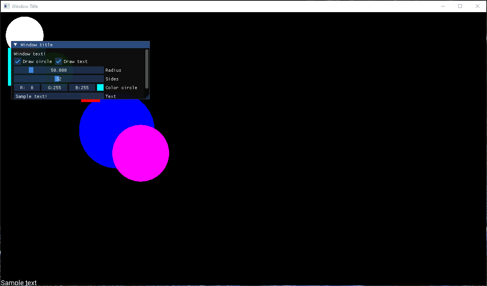

# SFML 2D Game Engine

This project is a simple game engine developed using C++ and the SFML and ImGui libraries. It generates shapes, fonts, and window properties from a configuration text file and provides basic control and collision detection for the shapes.

---

## Requirements

* SFML (Simple and Fast Multimedia Library)
* ImGui (Immediate Mode GUI)
* C++ compiler (MSVC)

## Features

* Dynamic Shape Generation: Creates shapes based on the configuration file.
* Basic Physics: Implements simple velocity-based movement and collision detection for shapes.
* GUI Controls: Provides an ImGui-based GUI for adjusting properties like shape color, radius, and text content.

## Demo

